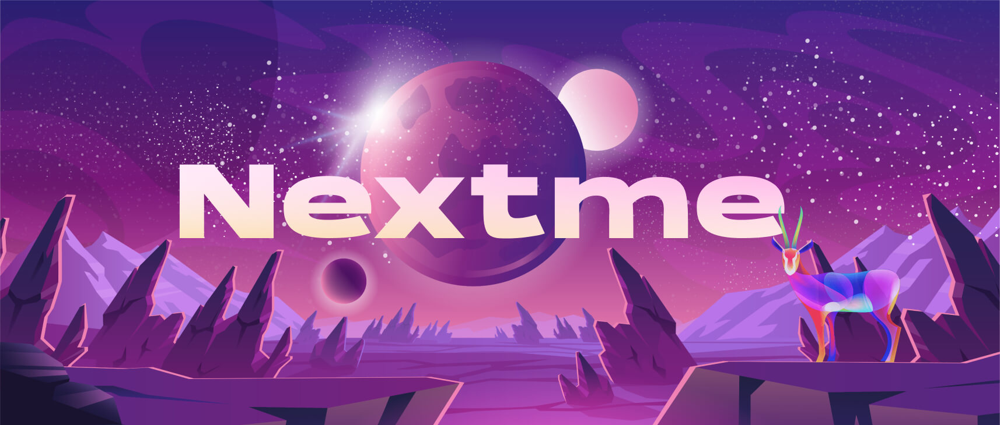

# Nextme

## Origin

> Nextme is committed to building a social economic network that connects creators, brands and users.

Focus 【Creator Economy】【Pay & Distribution of Benefits】【Social Data & Privacy】

## Slogan

> Pay and Earn in Social Layer.

<ul class="flex gap-5 sm:gap-8 !pl-0 pt-10">
  <li
    v-for="(row,index) in milestone.headData"
    class="animate__animated animate__slideInDown cursor-pointer"
    :key="`head-${index}`"
    :style="{
      animationDelay: `${index * 0.5}s`,
    }"
  >
    <image
      alt=""
      :src="`${cdn}/home/ecosystem/${row}.svg`"
      width="48"
      height="48"
      class="hover:scale-110 transition"
    />
  </li>
</ul>

## Mission

Nextme is a cross-chain and cross-platform decentralized social economy network.

It is a public social network similar in design to Instagram + PayPal, but encrypted.

Everyone owns their accounts and relationships、data ownership and earnings rights, which can be shared and taken anywhere.

Creators, brands and fans, communities can better share streams, discover interesting people, stories and meetups, and earn income through creation and interaction within cryptographic protocols.

!> Web2+3 Creator

Aggregate and Display Unlimited Social Links or Dynamic Works

Can be Links, Portfolio, Derivatives, UGC Feed, NFT Collection, Badge, etc.

!> Web2+3 Brand and Business

Not limited to merchants or enterprises, IP parties, etc. Display brand and influence more rich and beautifully; Data safe and permanent. Also support the issuance and sale of NFT or Badge on the chain, AI customer service and conference capabilities, etc. Connect the social RSS protocol of 1900+ relationship networks.

!> Web3 Developer and Organization

Open Nextme social portrait agreement and social identity SBT guarantee agreement to make user portrait analysis and creation delivery more accurate, make relationship connection and social graphs more complete, and make trust more efficient and decentralized; All individual identities are reviewed by the mapping data behind SBT, which can provide on-chain authentication services for DAOs, builders, institutions, etc; The Ads income generated by the social space belongs to all active users of the dapp protocol.

