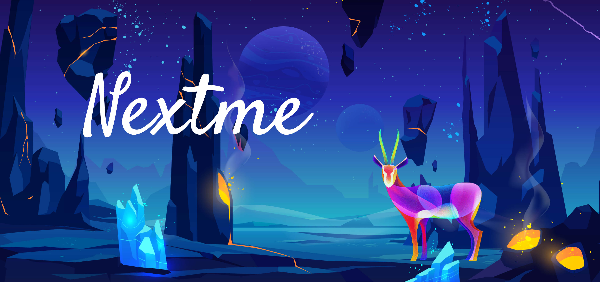

# Nextme

## Origin

A group of web2+3 creators

A group of web2+3 developers and builders

A Decentralized Community Next Labs

Let's create our next generation web2+3 social homepage together

## Vision

> The most Rich & Beautiful Web3 Social Portal and Space Protocol.

## Values

> Committed to becoming the most beautiful Web3 social portal and UGC square, allowing social data and portrait value to be distributed to all active individuals in a decentralized protocol.

We mainly help web2+3 creators, web3 builders and communities, web3 investors/developers/organizations and other user groups to open up and aggregate account IDs under many App application systems, and integrate on-chain and off-chain data into Personalized application in a centralized way.

Based on a set of Nextme DID to connect users' web2+3 social IDs, works, assets, contracts, etc. select and personalize their homepage from several vertical career templates, not limited to social media business cards, NFT/DAO/Club and other tokens Mint/AirDrop/Poap aggregated business page, community community Member Pass center, etc.

While helping 200 million+ individual creators and 10w+ small and medium-sized web2+3 organizations around the world to build and aggregate their own web2+3 homepages and communities, it also greatly reduces the cost of portal building for a brand or product to be released and sold. the average cost of designing front-end and back-end contracts is 3-5 manpower/tens of thousands of dollars.

In the follow-up plan, the Nextme DID Network API and portrait protocol will be opened to developers and toB organizations for on-chain user portrait analysis and accurate delivery.

!> web2+3 creators

Without design and programming, you can simply create, aggregate, and personalize your own homepage business card, which is more efficient for customer display and fan operation;

At the same time, you can cast your own works into NFT with one click, and fans can buy or sell on the portal page. Receive NFT and NFT-derived peripheral products at a certain price;

In community operation, you can also sell your own NFT Pass card to establish a long-term equity relationship with fans;

!> web3 builders & communities

Quickly DIY a Dapp portal homepage, aggregate display and customize your own community portal, not limited to brands such as NFT, DAO, Club, etc. At the same time, it supports the import of custom contracts to realize the read-write interaction of data on the contract ABI chain, such as NFT Mint/ Sale, Token AirDrop/Claim, POAP distribution, whitelist condition check mechanism, which can effectively prevent and control Sybil attacks;

!> web3 investors/developers/organizations & others

Not limited to developers, on-chain analysts, investment research teams

Based on Nextme DID Network API & portrait protocol, user analysis, marketing, precise delivery/airdrop, commercialization, etc.

