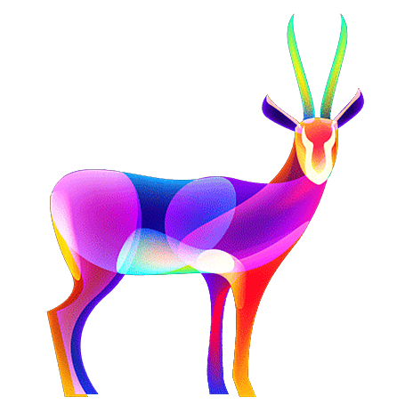

<h1 align="center">
  
</h1>

<h2>
  <a href='//nextme.one'>Nextme</a>
</h2>
<h3>Create Next Generation Web2+3 DID Social Gateway</h3>
<h4>Connect Your Web2+3 Ids, Links, Works, Data, Contracts, etc.</h4>

[Get Started](README.md)
